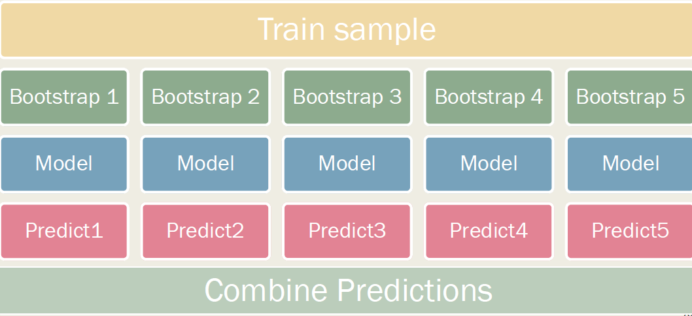
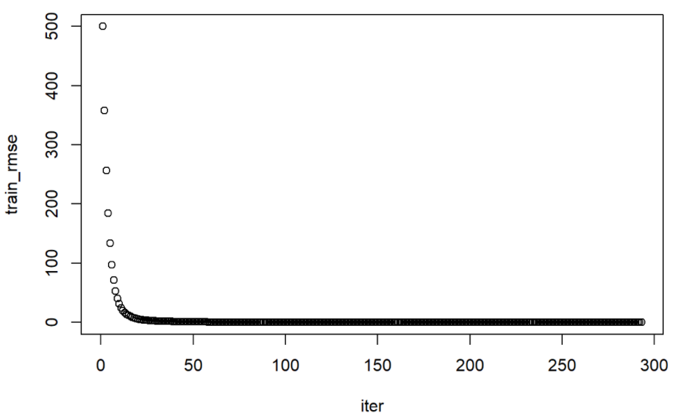

# Advanced Tree: Tuning Model Hyperparameters, Cross-Validation, Ensemble Models(Bagging, Random Forest, Boosting)
| Cons of Tree  | Solutions |
| ------------- | ------------- |
| Easy to overfit train data  | Cross-Validation to optimize complexity from picking good model hyperparameters  |
| Lower predictive accuracy  | Aggregating many decision trees |

### Load and Split Data
```
library(ISLR2)
data(Credit)

library(caret)
set.seed(1031)
split = createDataPartition(y = Credit$Balance, p = 0.7, list = F,groups = 10)
train = Credit[split,]
test = Credit[-split,]
```

## Tuning Model Hyperparameters
### Steps:
1. Indentify hyperparameters to tune
2. Specify range for evaluation (aka. *grid search*) 
3. Train a model on each combination of hyperparameters 
4. Measure and choose hyperparameter values for the model with **the lowest cross-validation error** (best performance)

```
#Hyperparameters that can be accessed: 
rpart.control(minsplit = 20, minbucket = round(minsplit/3), cp = 0.01,
maxcompete = 4, maxsurrogate = 5, usesurrogate = 2, xval = 10,
surrogatestyle = 0, maxdepth = 30, …)
```

# Cross-Validation
## Optimal Complexity: 
2 methods to estimate error on new data: 
1. **Apply a penalty on the training error rate to estimate the test error rate**. E.g., AIC, BIC, Mallow's Cp and Adjusted R2.
2. **Cross-Validation**: Is a part of resampling technique, which include Model Assessment (Estimate test error rates), Model Selection (Select model flexibility)

## Cross-validation Methods include:
1. Validation Set Approach: Randomly split the data into a estimation set and a validation set, and estimate, build model on estimate sample, and then assess performance on validation sample
2. **K-fold Cross Validation (Less bias and less variance, most commonly used)**: Randomly divide the data into k equal-sized parts, then fit the model to k-1 parts combined, and then obtain predictions for the left-out kth part. (k=1, 2...k takes turn and the results are combined). Works best for k =5 or 10
3. Leave One Out Cross-Validation (LOOCV)

### Tree Models
```
#Tree with default cp 0.01
library(rpart); library(rpart.plot)
tree = rpart(Balance~.,data = train, method = 'anova')

pred_train = predict(tree)
rmse_train_tree = sqrt(mean((pred_train - train$Balance)^2)); rmse_train_tree
```
```
#Maximal tree
maximalTree = rpart(Balance~.,data=train,control=rpart.control(cp=0))

pred = predict(maximalTree,newdata=test)
rmse_maximalTree = sqrt(mean((pred-test$earn)^2)); rmse_maximalTree
```
### Tuning tree
```
#tree tuned with 10-fold cross-validation
trControl = trainControl(method='cv',number = 10)
```
* `caret` framework makes the tuning process easier but can only tune using `cp`. (To use other hyperparameters, we can write loops to go through the grid.) 
* Next, we will specify the range of hyperparameter values for cp through experience or trial-and-error approach. For grid-search, it's better to begin with wide intervals then narrower intervals. Eg. seq(0,0.4,0.001) to seq(0,0.1,0.0001)
```
#Cross-validation for 100 different cp
tuneGrid = expand.grid(.cp = seq(from = 0.001,to = 0.1,by = 0.001))

cvModel = train(Balance~.,
                data=train,
                method="rpart",
                trControl = trControl,
                tuneGrid = tuneGrid)

cvModel$results
#Examine the cross-validation errors for each value of cp and select the value of cp that yields the lowest cross-validation error.
cvModel$bestTune

library(ggplot2)
ggplot(data=cvModel$results, aes(x=cp, y=RMSE))+
  geom_line(size=0.5,alpha=0.2)+
  geom_point(color='brown')+
  theme_bw()+
  ggtitle(label=paste('Lowest RMSE is at a cp of ',cvModel$bestTune$cp))
```
```
#Now we use the optimal value of cp and evaluate Tune model on Test sample
cvTree = rpart(Balance~.,data=train,cp = cvModel$bestTune$cp)
pred = predict(cvTree,newdata=test)
rmse_cvTree = sqrt(mean((pred-test$earn)^2)); rmse_cvTree
```

### Ensemble models used to improve tree includes bagging, forests, boosting.
* **Bootstrapping: Draw samples from original data with replacement** and repeat many times
* **Bagging and Forests**: Grow multiple trees by using **bottstrapped independent samples** and average predictions
* **Boosting: Frow a series of trees sequentially, each tree using informatino from the previously grown trees**

# Bagging
*An ensemble model that aggregates predictions from tree models fitted to a set of bootstrapped samples.*

It's to create multiple copies of the original training data set using the bootstrap, fit a separate decision tree to each copy, and then combine all of the trees in order to create a single predictive model.

* Combining models by averaging (metric outcome) or the majority (non metric outcome)
* We don't prune tree constructed in bagging, since it will average out. Averaging predictions reduce variance while unchanging bias
* Many packages can be implemented, including ipred, randomForest,adabag, bagEarth, treeBag, bagFDA
```
#randomForest library: mtry = number of ALL predictors
library(randomForest)
set.seed(1031)
bag = randomForest(Balance~.,data=train,mtry = ncol(train)-1,ntree=1000)
pred = predict(bag,newdata=test)
rmse_bag = sqrt(mean((pred-test$earn)^2)); rmse_bag
```
```
#ipred library: Need to specify the number of bootstrapped samples to fit
library(ipred)
set.seed(1031) 
bag = bagging(Balance~.,
              data = train, 
              nbagg = 1000)

pred_train = predict(bag)
rmse_train_bag_ipred = sqrt(mean((pred_train - train$Balance)^2)); rmse_train_bag_ipred

pred = predict(bag, newdata = test)
rmse_bag_ipred = sqrt(mean((pred - test$Balance)^2)); rmse_bag_ipred
```

# Random Forests
*Unlike bagged tree, random forests **use a random subset of features** for each bootstrapped tree to  de-correlate the trees, which reduce the vairance when average them out.*

* For classification problems, the number of predictors considered at each **split (m) is about to the square root of the total number of predictors (p)**. For regression problems, this is p/3. If m=p, it's the same as bagging
 and for classification problems, sqrt(p)

```
library(randomForest)
trControl = trainControl(method = 'cv', number = 5)
tuneGrid = expand.grid(mtry = 1:ncol(train)-1)
set.seed(1031)
forest_cv = train(Balance~., 
                  data = train, 
                  method = 'rf',  #method can be in 'ranger'
                  trControl = trControl, 
                  tuneGrid = tuneGrid, 
                  ntree = 1000)
forest_cv$bestTune$mtry
```
ranger package: A faster implementation of Random Forests, particularly suited for high dimensional data

```
library(ranger)
set.seed(1031)
forest_ranger = ranger(Balance~.,
                       data = train, 
                       num.trees = 1000)
pred_train = predict(forest_ranger, data = train, num.trees = 1000)
rmse_train_forest_ranger = sqrt(mean((pred_train$predictions - train$Balance)^2)); rmse_train_forest_ranger

pred = predict(forest_ranger, data = test, num.trees = 1000)
rmse_forest_ranger = sqrt(mean((pred$predictions - test$Balance)^2)); rmse_forest_ranger
```

# Boosting
Gradiant Boosting Machine:
1. n.trees: The number of trees which is selected through cross-validation. (If trees is too large, boosting can overfit)
2. shrinkage: Control the rate at which boosting learns, typically is 0.01 or 0.001
3. interaction.depth: Control the complexity (interaction order) of the boosted ensemble
* Prone to overfitting, and sensitive to extreme values

## gbm
```
library(caret)
set.seed(1031)
trControl = trainControl(method="cv",number=5)
tuneGrid = expand.grid(n.trees = 500, 
                       interaction.depth = c(1,2,3),
                       shrinkage = (1:100)*0.001,
                       n.minobsinnode=c(5,10,15))

garbage = capture.output(cvModel <- train(Balance~., data=train, method="gbm", trControl=trControl, tuneGrid=tuneGrid))

set.seed(1031)
cvboost = gbm(Balance~.,
              data=train,
              distribution="gaussian",
              n.trees=500,
              interaction.depth=cvModel$bestTune$interaction.depth,
              shrinkage=cvModel$bestTune$shrinkage,
              n.minobsinnode = cvModel$bestTune$n.minobsinnode)

pred_train = predict(cvboost, n.trees=500)
rmse_train_cv_boost = sqrt(mean((pred_train - train$Balance)^2)); rmse_train_cv_boost

pred = predict(cvboost, newdata = test, n.trees = 500)
rmse_cv_boost = sqrt(mean((pred - test$Balance)^2)); rmse_cv_boost
```
## xgboost
XGBoost is an optimized distributed gradient boosting library designed to be highly efficient, flexible and portable. But while using xgboost, all factor class variables need to be dummy coded and fed into the model as a matrix. To do this, we will dummy code using library(vtreat).
```
library(xgboost)
xgboost = xgboost(data=as.matrix(train_input), 
                  label = train$Balance,
                  nrounds=10000,
                  verbose = 0,
                  early_stopping_rounds = 100)
xgboost$best_iteration
```
```
plot(xgboost$evaluation_log)
```

```
pred_train = predict(xgboost, 
               newdata=as.matrix(train_input))
rmse_train_xgboost = sqrt(mean((pred_train - train$Balance)^2)); rmse_train_xgboost
pred = predict(xgboost, 
               newdata=as.matrix(test_input))
rmse_xgboost = sqrt(mean((pred - test$Balance)^2)); rmse_xgboost
```