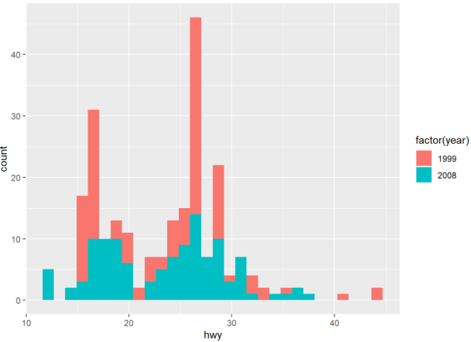
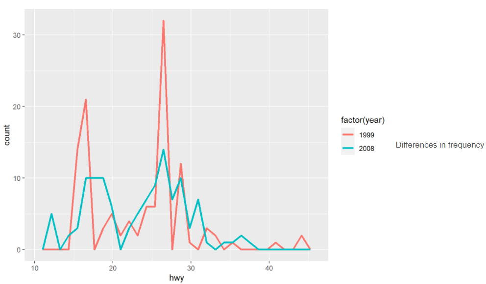
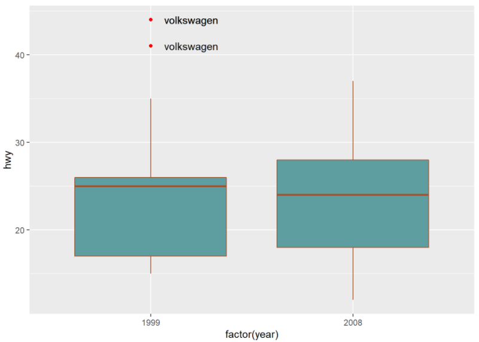
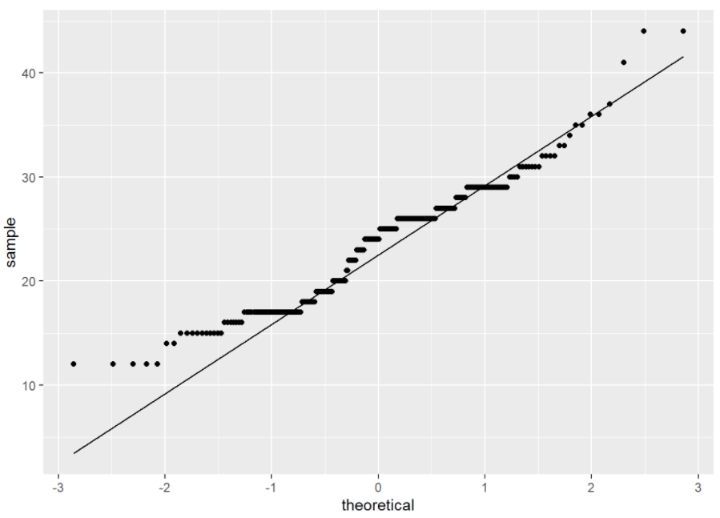
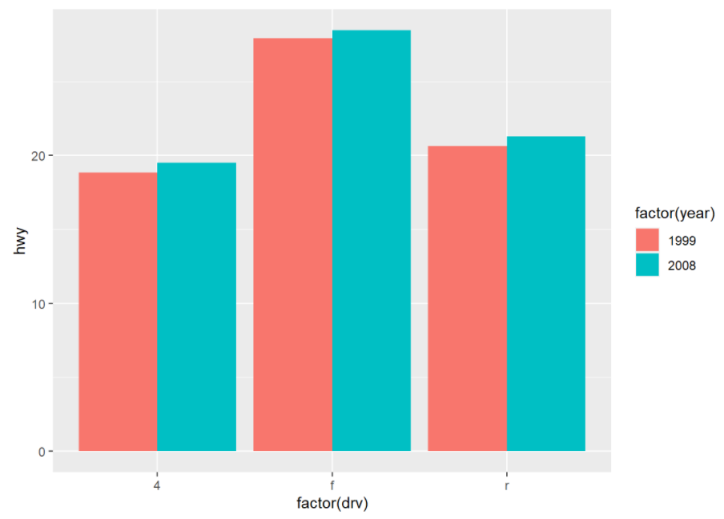
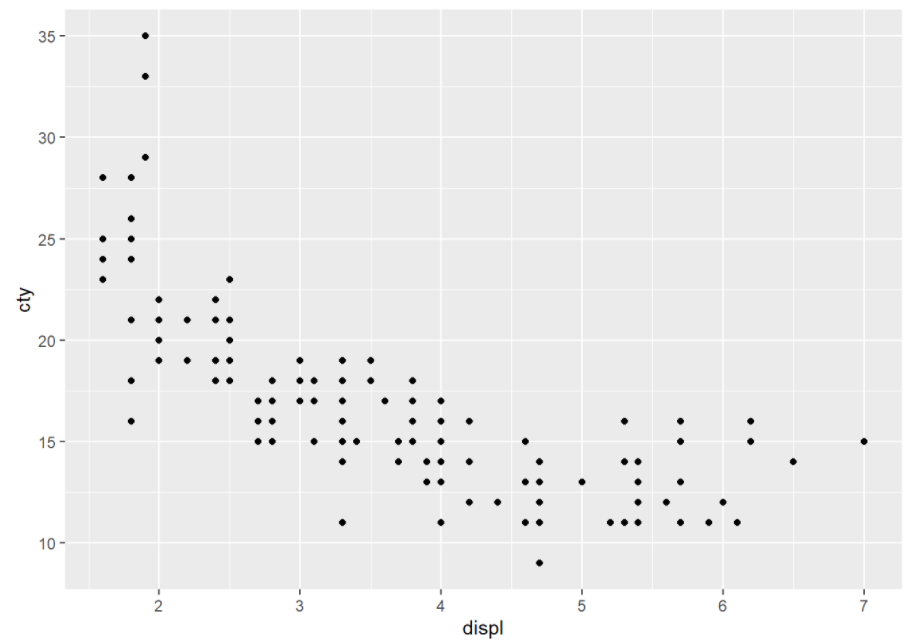
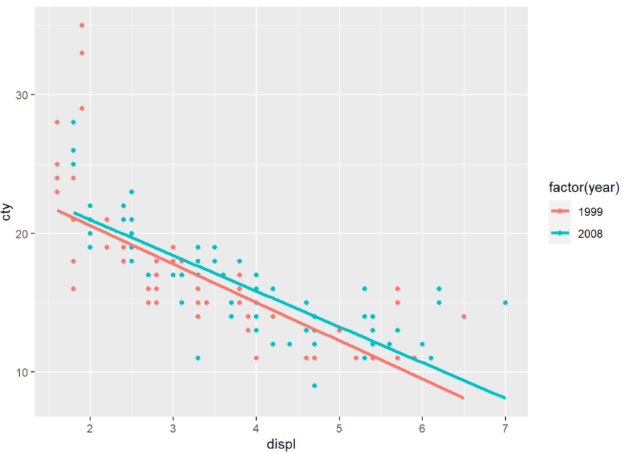
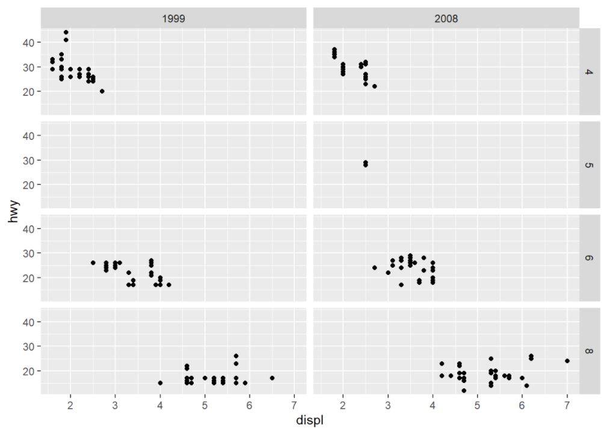

_Data Visualization is a great approach to understand your data and present your results._

In R, we use ggplot2 library to visualize our data. The template for graphic in ggplot2 is:

```
ggplot(data = <Enter Data Here>, 
mapping = aes(<Enter Aesthetic(s) here>)) + <Enter geom function here> 
```


We will use mpg data for example.

```
library(ggplot2)
str(mpg)
```


### To examine distribution, we could use histogram, frequency polygon, desnity curve, boxplot, and QQplot.

**_Histogram: The most common chart to explore the distribution of a numerical variable._**

Let us examine the distribution of highway gas mileage (hwy). 

```
ggplot(data=mpg,mapping = aes(x=hwy))+
  geom_histogram()
```
* By default, geom_histogram use 30 as number of bins. we could override it by sepcifying bins or binwidth argument.
* To compare distributions, we could put interested variable to fill.

```
ggplot(data=mpg,mapping = aes(x=hwy,fill=factor(year)))+
  geom_histogram() 
  ```



**_Frequnecy Polygon: By replacing geom_histogram() with geom_freqpoly(), we could avoid overlaid bins._** It will be easier to see and compare data. And therefore, in this case, we use color as argument. 
```
ggplot(data=mpg,mapping = aes(x=hwy,color=factor(year)))+
  geom_freqpoly(size=1.2)
```


**_Boxplot: useful for comparing distributions and spotting outliers._**
```
ggplot(data=mpg,aes(x="",y=hwy))+
  geom_boxplot()

ggplot(data=mpg,aes(x=factor(year),y=hwy))+
  geom_boxplot(outlier.color='red', fill='cadetblue',color='sienna')+
  geom_text(data=mpg[mpg$hwy>quantile(mpg$hwy,0.99),], aes(label=manufacturer),nudge_x = 0.2)
```
 

**_QQplot: useful to examine if the data is normally distributed._** 
* If the data are normally distributed the points in the plot will cluster around the diagonal running from bottom left to top right. 

```
ggplot(data=mpg, aes(sample=hwy))+
  geom_qq_line()+
  geom_qq()
  ```



### To compare or examine relationship between groups, we could use bar chart, scatter plot, line graph

**_Bar Chart: usually used for comparing numerical variables across levels of a categorical variable_**

```
ggplot(data=mpg,aes(x=factor(drv),fill=factor(year),y=hwy))+
  geom_bar(stat = 'summary', fun='mean', position='dodge')

#'position' as 'dodge' is easier to spot the difference between years, as compared to stack over.
```


**_Scatterplot: used for two numeric variables._**

```
ggplot(data=mpg,aes(x=displ,y=cty,color=factor(year)))+
  geom_point()
  ```


**_Line Graph: useful for spotting trend_**

```
ggplot(data=mpg,aes(x=displ,y=cty,color=factor(year)))+
  geom_point()+
  geom_smooth(method='lm',se=F,size=1.2)
  ```


**_Grid_**

```
ggplot(data=mpg,aes(x=displ,y=hwy))+
  geom_point()+
  facet_grid(cyl~year)
  ```




---
Reference:

. Google Groups, and Stack Overflow

. Cheatsheet

. ggplot2 functions

Books: ggplot2: Elegant Graphics for Data Analysis by Hadley Wickham, Graphical Data Analysis with R by Antony Unwin, and R Graphics Cookbook.