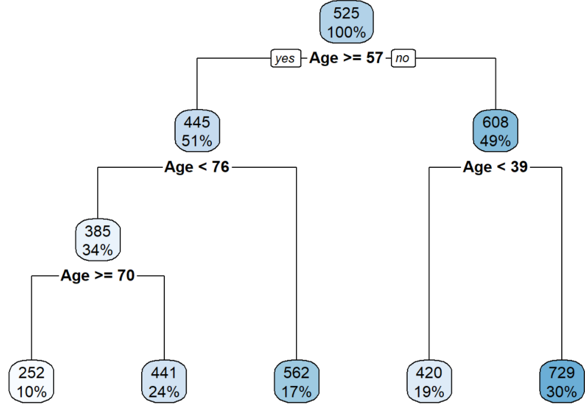

# Decision Tress
Used when relationships of variables are ***non-linear or interact and large number of independent variables***.

A Tree is a predictive model stratifying or segmenting the predictors into a number of simple regions based on similar attributes. But tree relatively perform poorly in prediction and tend to overfit the data, especially when it's a large tree.

A tree can handle many types of predictors (sparse, skewed, continuous, categorical) or missing (using surrogate splits) without the
need to preprocess them.

## Regression Tree: 
Outcome is continuous; `method = 'anova'`

Predictors that appear **higher** in the tree, or **multiple times** in the tree will be **more important** than predictors that appear lower in the tree or not at all.

```
library(ISLR2)
data(Credit)
```

### Split Data
```
library(caret)
set.seed(1031)
split = createDataPartition(y = Credit$Balance, p = 0.7, list = F,groups = 10)
train = Credit[split,]
test = Credit[-split,]
```

### Estimate
```
library(rpart); library(rpart.plot)
tree1 = rpart(Balance~Age,data = train, method = 'anova')
rpart.plot(tree1)
```

```
#use built tree model to predict, type='vector by default.
predict2 = predict(tree1, newdata = data.frame(Age = 20), type='vector')

#Root Mean Squared Error (rmse) summarize the quality of predictions.
rmse = sqrt(mean((predict2 - train$Balance)^2)); rmse
```
***We use minsplit, minbucket, maxdepth, cp to control the size of tree.***
Size of the tree is measured by number of leaves.

1. **minsplit: the minimum number of observations that must exist in a node to have a split attempted.**
```
rpart(Balance~.,data = train, method = 'anova', control = rpart.control(minsplit = 100))
#Increasing minsplit leads to a smaller tree
```
2. **minbucket: the minimum number of observations in any terminal node**
```
rpart(Balance~.,data = train, method = 'anova', control = rpart.control(minbucket = 25))
#Increasing minbucket leads to a smaller tree.
```
3. **maxdepth: the maximum depth of any node of the final tree**
```
rpart(Balance~.,data = train, method = 'anova', control = rpart.control(maxdepth = 3))
#Smaller the value of maxdepth, smaller the tree. A dept of 3 means three levels of nodes after the root node
```

4. **cp = complexity parameter. It is used to add a penalty for a large tree.** _The penalty is the product of cp and number of leaves_.

```
rpart(Balance~.,data = train, method = 'anova', control = rpart.control(cp = 0.1))
#Larger cp is greater penalty for complexity which will result in smaller trees. cp is 0.01 by default
```

## Classifiaction Tree: 
Outcome is categorical; `method = 'class`

Classification trees automatically conduct feature selection.

### Estimate
```
library(rpart); library(rpart.plot)
tree1 = rpart(Balance_hilo~Age,data = train, method = 'class')

rpart.plot(tree1)
```

### Predict
Like in logistic regression, `predict` function can get a predicted probability (`type = ‘prob’` by default) or predicted class (`type = ‘class’`).
```
predict(tree1, newdata = data.frame(Age = 20), type='prob')
predict(tree1, newdata = data.frame(Age = 20), type='class')

#Extract predictions for the target class from the second column of the prediction matrix 
pred2 = predict(tree1, type='prob')[,2]
```
Here, we will use a threshold of 0.5 and assign class labels to the predictions.
```
pred_class = factor( ifelse( pred2 > 0.5,'high','low'), levels = c('low','high'))
```
### Performance Measures: Log-loss, Accuracy, Specificity, Sensitivity, AUC
* Accuracy, Specificity and Sensitivity can be derived from the classification table/ matrix
```
ct = table(train$Balance_hilo,pred2_class); ct
accuracy = sum(ct[1,1],ct[2,2])/nrow(train); accuracy
specificity = ct[1,1]/sum(ct[1,1],ct[1,2]); specificity
sensitivity = ct[2,2]/sum(ct[2,1],ct[2,2]); sensitivity
```
* Another way for performance matrix is through caret package
```
library(caret)
confusionMatrix(data = pred_class,
                reference = train$Balance_hilo, 
                positive = 'high')
```
