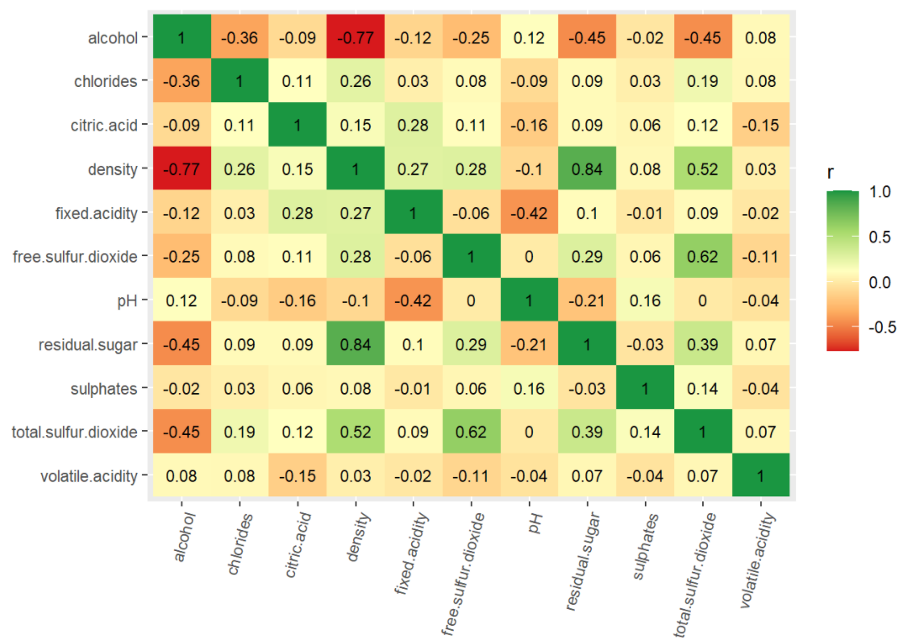
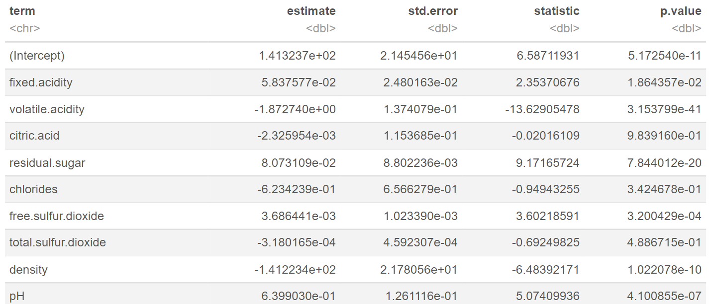
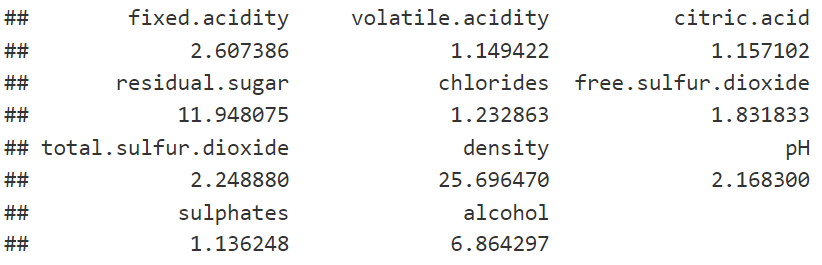
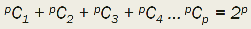
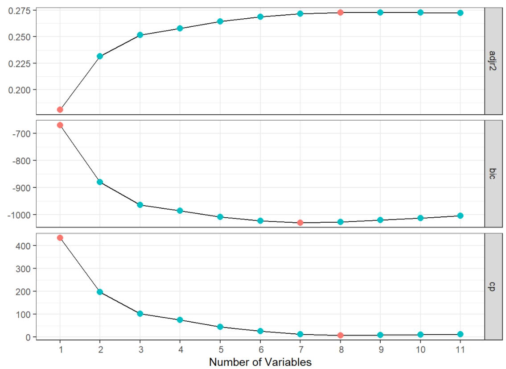

# Feature Selection
***Feature Selection is to build simple models***, since multicollinearity among predictors will inflate standard errors of coefficients as predictors increases.

### Data Source: [wine](https://archive.ics.uci.edu/ml/datasets/wine+quality)


### Read & Split Data
```
wine = read.table("winequality-white.csv",header=TRUE,sep=";")
library(caret)
set.seed(1031)
split = createDataPartition(y=wine$quality,p = 0.7,list = F,groups = 100)
train = wine[split,]
test = wine[-split,]
```

## Methods for Feature Selection
### 1. **Theory**: 
Use published literature or domain knowledge to pick variables.

### 2. **Filter Methods: Keep relevant but not redundant variables.**

(1) **Bivariate Filter**: Keep predictors that are relevant (high bivariate correlation between a predictor and outcome) but not redundant (low bivariate correlation between predictors).

* Correlaion is looking at linear relationship, so sometimes, you may need to tranform (such as `log`) variable first
```
round(cor(train[,-12]), 2)*100 #Round it to see the number better
```

Visual correlation into matrix:
```
library(tidyr); library(dplyr); library(ggplot2)
corMatrix = as.data.frame(cor(train[,-12]))
corMatrix$var1 = rownames(corMatrix)

corMatrix %>%
  gather(key=var2,value=r,1:11)%>%
  arrange(var1,desc(var2))%>%
  ggplot(aes(x=var1,y=reorder(var2, order(var2,decreasing=F)),fill=r))+
  geom_tile()+
  geom_text(aes(label=round(r,2)),size=3)+
  scale_fill_gradientn(colours = c('#d7191c','#fdae61','#ffffbf','#a6d96a','#1a9641'))+
  theme(axis.text.x=element_text(angle=75,hjust = 1))+xlab('')+ylab('')
```

Red color is strongly negative correlated; green is strongly positive correlated. We want to remove predictors that are highly correlated with another to be non-redundant.

(2) **Multivariate Filter**: Examine relevance and redundancy of all predictors together. It's to know which variables together have affect on the response while in pairwise case doesn't show. 
* High relevance = **significant regression coefficients**
```
model = lm(quality~.,train)
library(broom)
summary(model) %>%
  tidy()
#Coefficient, p-value can be examined in the table below
```


* **Multicollinearity: measured by Variance Inflating Factor (VIF) or Tolerance**, _higher VIF is higher multicollinearity, which is high redundancy_
```
library(car)
vif(model)
```

**`VIF >= 5` : moderate-high multicollinearity; `VIF >10`: serious multicollinearity**

### 3. **Subset Selection**: ***Identify a subset of p predictors that are related to the outcome.***

#### Evaluation Criteria:
Training set error will decrease as more variables are added, `even though those variables aren't relevant`, but the test error may not. So, Residual Sum of Squares (RSS) and training set R2 cannot be in use. To select the best model as regards to test error, we could 

**(1) Indirectly estimate test error by making an adjustment to the training error**:

| AIC  | = 2logL + 2d |
| :-------------: | :-------------: |
| **BIC**  | = 1/n (sse + log(n) d σ ^ 2)|
| **Cp**  | = 1/n (sse + 2d σ ^ 2)|
| **Adjusted R^2**  | = 1- (sse /(n-d-1))/(sst/(n-1))|

- L = maximized value of likelihood function
- σ^2 = estimate of the variance of error 
- d = number of parameters
- sse = sum of squared errors/residuals 
- sst = total sum of squares

***In general, a good model has low value of AIC, BIC, Cp and high value for adjusted R^2.***

* Adjusted R^2 will be better even if you are just adding random column. Since R^2 will decrease nosie, adjusted R^2 will normalize it.
* As number of variables increase, AIC, BIC, Cp drops, adjusted R^2 increases.

**(2) Directly estimate test error using validation set approach or cross-validation**

**(2-1) Best Subset Selection**: Step 1. Consider all possible subsets of p predictors.
Step 2. Fit a model with each subset.
Step 3. Pick the best performing model

Say you have 90 variables (p=90), models will be chosen by 1, 2,...as equation shown below. Therefore, large p may result in overfitting and high variance of coefficient estimates.


Therefore, this approach could be slow and computationally intensive. **NOT** recommended for big data analysis.

```
# install.packages('leaps')
library(leaps)
subsets = regsubsets(quality~.,data=train, nvmax=11)
summary(subsets)

subsets_measures = data.frame(model=1:length(summary(subsets)$cp),
                              cp=summary(subsets)$cp,
                              bic=summary(subsets)$bic, 
                              adjr2=summary(subsets)$adjr2)

library(ggplot2)
library(tidyr)
subsets_measures %>%
  gather(key = type, value=value, 2:4)%>%
  group_by(type)%>%
  mutate(best_value = factor(ifelse(value == min(value) | value== max(value),0,1)))%>%
  ungroup()%>%
  ggplot(aes(x=model,y=value))+
  geom_line(color='gray2')+
  geom_point(aes(color = best_value), size=2.5)+
  scale_x_discrete(limits = seq(1,11,1),name = 'Number of Variables')+
  scale_y_continuous(name = '')+
  guides(color=F)+
  theme_bw()+
  facet_grid(type~.,scales='free_y')
  #Based on adj R^2, Cp, 8 variables should be used in modlel, but based on BIC, 7 variables shoule be used.
  ```

```
# 8 variables will the lowest cp
coef(subsets,which.min(summary(subsets)$cp))
````
**(2-2) Forward Selection**:

**(2-3) Backward Selection**:

**(2-4) Stepwise Variable Selection**:

### 4. **Shrinkage**: Fit a model with all p predictors, but the ***estimated coefficients are shrunken towards zero relative to least squares estimates***. This shrinkage (also known as regularization) could reduce variance and perform variable selection.


### 5. **Dimension reduction**: Group predictors into a reduced number of components based
on similarity. Use the components as predictors.

### 6. Iterative Methods : Repeatedly supply predictor subsets to the model and then use the
resulting model performance estimate to guide the selection of the next subset to
evaluate.
PS: Above methods do not apply to predictive models (e.g., trees) which automatically pick features. Such models couple the
predictor search algorithm with parameter estimation, and are therefore thought to have built in feature selection.