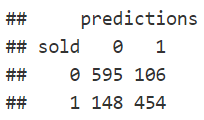
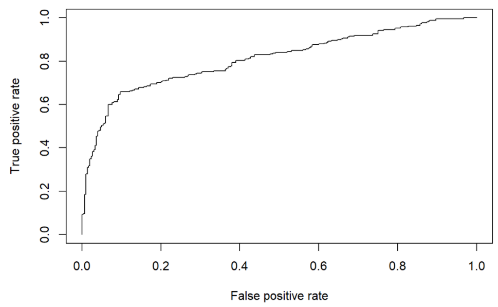
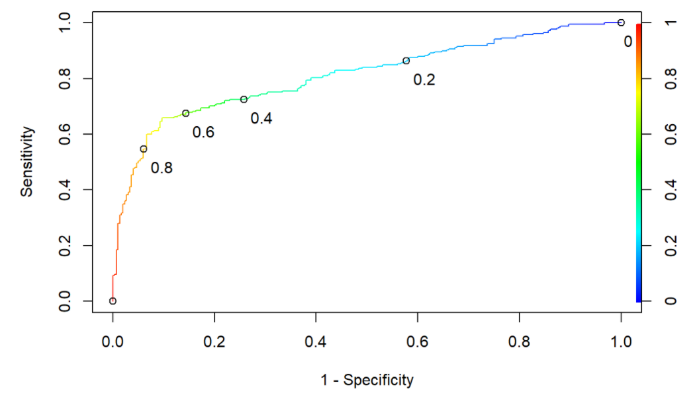
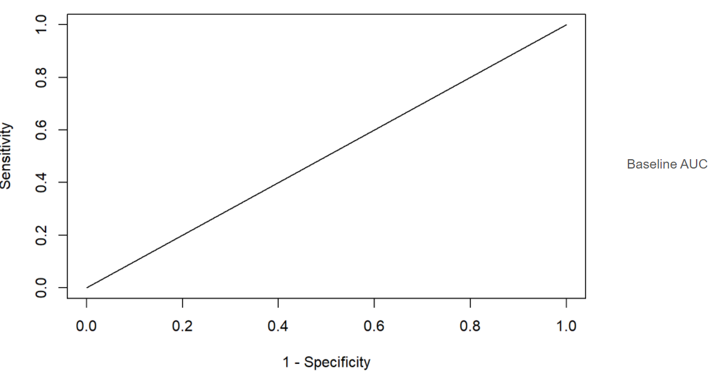

# logistic Regression

***In logistic regression, outcome can only take two values. Logistic Regression predicts probability of the occurrence of an event.***

E.g., 0.7 implies there is a 70% chance an event will occur. To convert these probabilities into a binary outcome, we use a threshold or cutoff value 0.5. If p = 0.72 would be predicted to have event; if p = 0.34 would be predicted to have event.

_Choice of threshold is often defined based on the __cost associated with a False Positive and a False Negative__, which will vary widely based on application area._

Generally, 

| High threshold  | Low threshold |
| ------------- | ------------- |
| Higher specificity  | Lower specificity  |
| Lower sensitivity  | Higher sensitivity  |


|              | Actual Yes | Acutal No |
| :---         |     :---:      |          ---: |
| Predicted Yes| True Positive     | False Positive (Type I Error; alpha)    |
| Predicted No    | False Negative (Type II Error; beta)       | True Negative (power = 1- beta)      |
| git diff     | Sensitivity = TP/(TP+FN)       | Specificity = TN/(TN+FP)  |


* Cost of false negatives can be accounted for by the Specificity and cost of false negatives by the Sensitivity. 
* Accuracy (Hit Ratio)= (TN+TP) / (TN+TP+FN+FP)
* Precision = TP / (Predicted Positive) 

### eBay Data
The original data consisting of eBay auctions for iPads was simplified and new variables derived. The goal of the analysis is to predict which iPad listed on eBay will be sold, a binary outcome.
```
library(caTools)
set.seed(617)
split = sample.split(data$sold,SplitRatio = 0.7)
train = data[split,]
test = data[!split,]
```
### Estimate Model

```
model1 = glm(sold~startprice,data=train,family='binomial')
model1
```
### Prediction
```
predict(model1,newdata=data.frame(startprice=200),type='response') 
```

### Is the coefficient of startprice significant?
```
summary(model1)
```

## Strength of Model

**1. How Strong is the relationship between variables?** 

_Log-likelihood based measures are commonly used, which include:_

**(1) 2Log Likelihood (or Residual Deviance)**: Measure of error in the model. Lower is better.
```
model1$deviance
```
**(2) Model Chi-square**: Difference of error between baseline and new model; higher and statistically significant is better.
```
model_chi_square  = model1$null.deviance - model1$deviance
df = model1$df.null - model1$df.residual
p_val = pchisq(model1$null.deviance - model1$deviance, 
       df=model1$df.null - model1$df.residual, 
       lower.tail=FALSE)
paste('Chi-square value of',model_chi_square , 'with',df , 'df', 'corresponding to a p-value of', p_val )
```
**(3) Pseudo R2: Designed to mimic R2 from linear regression**. There are a few types including: McFadden R2, Cox and Snell R2, and Nagleklerke R2.
```
dev = model1$deviance
nulldev = model1$null.deviance
n = nrow(train)
mcfadden_r2 = 1 - dev/nulldev
cox_and_snell_r2 = 1 - exp(-(nulldev - dev)/n)
nagelklerke_r2 = cox_and_snell_r2/(1 - exp(-nulldev/n))
mcfadden_r2; cox_and_snell_r2; nagelklerke_r2
```
**(4) AIC: Measure of relative quality of model. Lower is better**. Can only be used to compare two models. Not meaningful in an absolute sense.
```
model1$aic
```

**2. Accuracy of Predictions**
* Accuracy or hit ratio (compared to baseline)
* Specificity
* Sensitivity
* Area Under the Curve (AUC)

Once the probabilities are converted to a binary outcome, they can easily be compared to the true values. Predictions are summarized into a classification table below:

```
ct = table(sold = train$sold,
           predictions = as.numeric(pred>0.5))
ct
```


```
accuracy = sum(ct[1,1],ct[2,2])/nrow(train); accuracy   #Output: 0.8050652
specificity = ct[1,1]/sum(ct[1,1],ct[1,2]); specificity #Output: 0.8487874
sensitivity = ct[2,2]/sum(ct[2,1],ct[2,2]); sensitivity #Output: 0.7541528
```
However, **a better baseline is to compare it to majority class**. Higher cutoff value will lead to higher accuracy. While higher accuracy is desirable, what is a good value really depends on the data.
```
prop.table(table(train$sold))
#In the case, not majority class is sold==0
```
## ROC and Area Under the Curve (AUC)
ROC curves allow us to visualize the impact of different thresholds on Specificity and Sensitivity. **AUC is a model performance measure that is independent of any particular cutoff or threshold.**

```
library(ROCR)
ROCRpred = prediction(pred,test$sold)
ROCRperf = performance(ROCRpred,"tpr","fpr")
plot(ROCRperf)
```

```
#Color coded and annotated
plot(ROCRperf,colorize=TRUE,print.cutoffs.at=seq(0,1,0.2),text.adj=c(-0.3,2),
     xlab="1 - Specificity",ylab="Sensitivity") 
```

```
as.numeric(performance(ROCRpred,"auc")@y.values) # auc measure
```
### As a reference, here is what the ROC for a baseline model will look like

```
baselinePred = pred*0
ROCRpred = prediction(baselinePred,test$sold)
ROCRperf = performance(ROCRpred,"tpr","fpr")
plot(ROCRperf,xlab="1 - Specificity",ylab="Sensitivity") # relabeled axes
```


