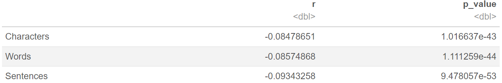
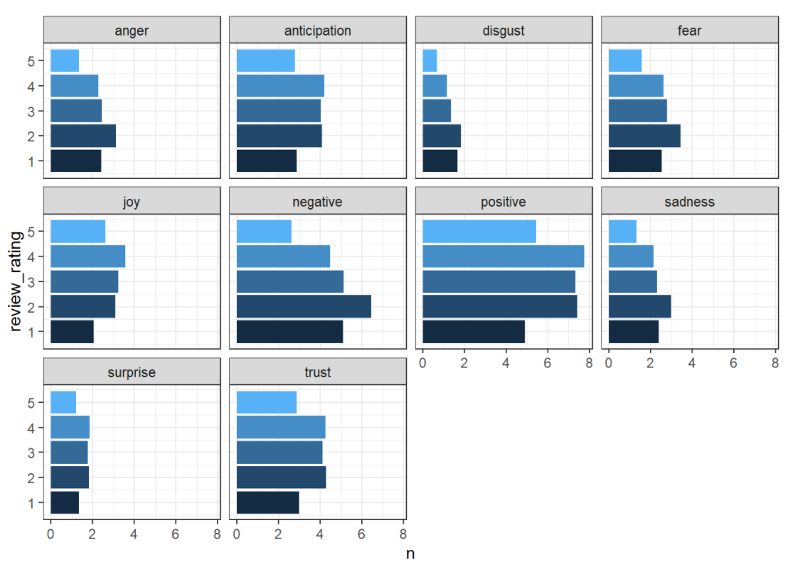
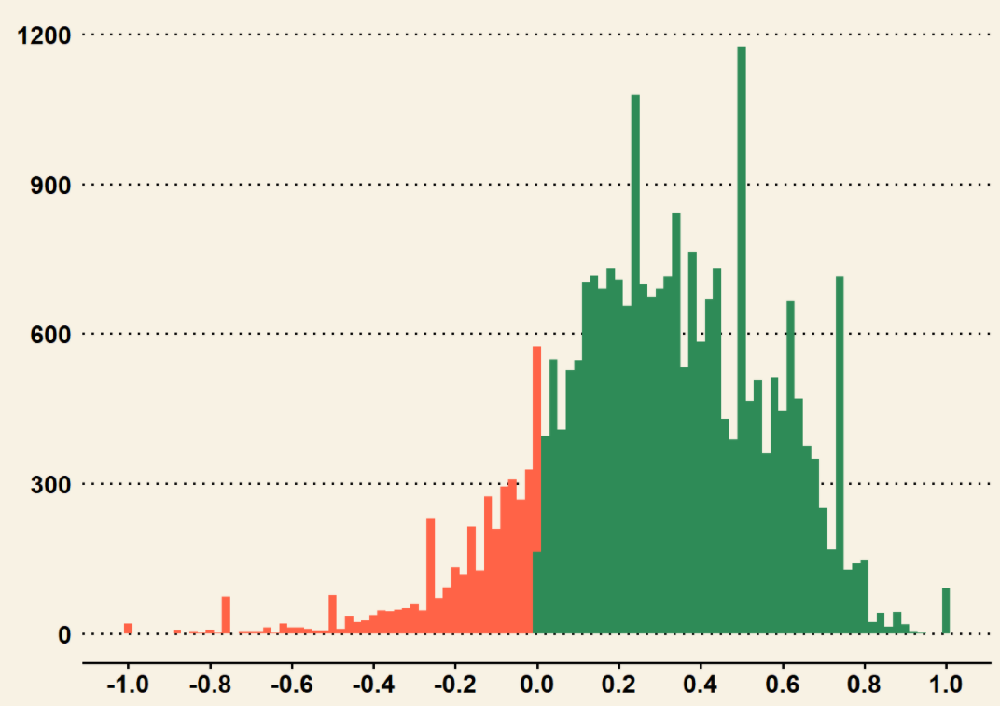

# Text Mining
Text Mining = Data Mingin + Natural Language Processing

## Sentiment Analysis: 

Steps:

### 1. Get Text 

### 2. Explore and Prepare Text 
```
#Distribution of Rating
library(ggplot2); library(ggthemes)
ggplot(data=df,aes(x=rating))+
  geom_histogram(fill='sienna3')+
  theme_bw()+
  scale_x_reverse()+
  xlab('Review Rating')+
  coord_flip()
```

(1) Count the number of characters: 
```
nchar(df$review[617])
```
*character is every single token*

(2) Count the number of words: *The definition of a word is conveyed to the computer as a pattern.*
```
library(stringr)
str_count(string = df$review[617],pattern = '\\S+')

#or use strsplit()
str_count(strsplit(df$review[617], split = ' '))
```
* *' \ \S+' : 'S' as space; '+' as the thing after the space*

(3) Count the number of sentences:
The definition of a sentence is encoded as a regular expression. 
```
str_count(string = df$review[617],pattern = "[A-Za-z,;'\"\\s]+[^.!?]*[.?!]")
```
* Regular expressions (regex) is a framework for teaching a computer how to recognize patterns of text. 
* Can also use spicy package here.

**Is longer review related with rating?**
```
r_characters = cor.test(nchar(df$review),df$review_rating)

r_words = cor.test(str_count(string = df$review,pattern = '\\S+'),df$review_rating)

r_sentences = cor.test(str_count(string = df$review,pattern = "[A-Za-z,;'\"\\s]+[^.!?]*[.?!]"),df$review_rating)

correlations = data.frame(r = c(r_characters$estimate, r_words$estimate, r_sentences$estimate),p_value=c(r_characters$p.value, r_words$p.value, r_sentences$p.value))
rownames(correlations) = c('Characters','Words','Sentences')

correlations
```

From the table, we see that the relation is quite small, while p-value is significant. So, we could say that there's no relationship between length of review and rating.

(4) Detect Upper Case
```
percentUpper = 100*str_count(df$review,pattern='[A-Z]')/nchar(df$review)
summary(percentUpper)
```

(5) Detect Keyword: Examine if keyword 'well facilities'
```
library(stringr)
mean(str_detect(string = tolower(df$review),pattern = 'well facilities'))*100
```

(6) Look for common words: 
```
library(dplyr); library(tidytext); library(magrittr)

#Remove the top 25 stopwords like prepositions and articles using anti-join and tidytext::stop_words

df%>%
  unnest_tokens(input = review, output = word)%>%
  select(word)%>%
  anti_join(stop_words)%>%
  group_by(word)%>%
  summarize(count = n())%>%
  ungroup()%>%
  arrange(desc(count))%>%
  top_n(25)
```

### 3. Tokenize: Words are examined independent of their position in text. `tidytext::unnest_tokens`
(Break a text, character sequence, document into n word token)
```
library(dplyr); library(tidytext)
df %>%
  select(id,review)%>%
  group_by(id)%>%
  unnest_tokens(output = word,input=review)%>%
  ungroup()%>%
  group_by(id)%>%
  summarize(count = n())
  ```
  * The default token is word, but output can also be as ngram, characters, or sentences.

### 4. Categorize tokens using a lexicon
*Lexicon: Dictionary of words*

* The bing and nrc emotion lexicons **classify a word** based on the presence or absence of an emotion or valence. 
* The afinn lexicon **scores each word based on the extent** to which it is positive or negative. 

#### (1) Binary (positive/negative)

`tidytext:: get_sentiments('bing')`
`dplyr: inner_join()`
```
tidytext:: unnest_tokens(output = word, input = review ) %>%
inner_join(get_sentiments( 'bing' )) %>%
group_by (sentiment)
```

#### (2) Emotion: Categorize words based on emotion reflected 

Method 1: Get Lexicon from tidytext in interactive mode (i.e., console or script, not markdown)
```
tidytext::get_sentiments('nrc') 
```

Method 2: Get Lexicon posted on github

```
nrc = read.table(file = 'https://raw.githubusercontent.com/pseudorational/data/master/nrc_lexicon.txt',
                 header = F,
                 col.names = c('word','sentiment','num'),
                 sep = '\t',
                 stringsAsFactors = F)
nrc = nrc[nrc$num!=0,]
nrc$num = NULL
```

```
#Emotions and Ratings
library(tidyr)
df%>%
  group_by(id, rating)%>%
  unnest_tokens(output = word, input = review)%>%
  inner_join(nrc)%>%
  group_by(id,sentiment,rating)%>%
  count()%>%
  group_by(id,sentiment, rating)%>%
  pivot_wider(names_from = sentiment,values_from = n)%>%
  mutate_at(.vars = 3:12, .funs = function(x) replace_na(x,0))%>%
  ungroup()%>%
  pivot_longer(cols = anticipation: sadness, names_to = 'sentiment',values_to = 'n')%>%
  group_by(sentiment, rating)%>%
  summarize(n = mean(n))%>%
  ggplot(aes(x=rating,y=n,fill=rating))+
  geom_col()+
  facet_wrap(~sentiment)+
  guides(fill=F)+
  coord_flip()+
  theme_bw()
  ```


From the graph, we see that 'positive' emotion is not skewed to certain ranged of ratings. This could indicate that nrc sentiment on a single word may not be that effective as to include the context.

#### (3) Sentiment score: You will know the "intensity" of being positive/negative
```
afinn = tidytext:: get_sentiments('afinn') 
```
**Approach 1- Jockers:**
Scores for words range from -1 to +1, which will give a more compacted distribution of data

```
library(lexicon)
df %>%
  select(id,review)%>%
  group_by(id)%>%
  unnest_tokens(output=word,input=review)%>%
  inner_join(key_sentiment_jockers)%>%
  summarize(reviewSentiment = mean(value))%>%
  ungroup()%>%
  ggplot(aes(x=reviewSentiment,fill=reviewSentiment>0))+
  geom_histogram(binwidth = 0.02)+
  scale_x_continuous(breaks=seq(-1,1,0.2))+
  scale_fill_manual(values=c('tomato','seagreen'))+
  guides(fill=F)+
  theme_wsj()
  ```


#### (4) Text Filters: Use profanity to filter out words that don’t add additional or useful information.
```
df %>%
  group_by(id)%>%
  unnest_tokens(output = word, input = review)%>%
  ungroup()%>%
  select(id, word)%>%
  anti_join(data.frame(word = c(profanity_banned, profanity_racist)), 
                       by = c('word'='word'))
```


### 5. Summarize results: Topic Modeling, Latent Semantic Analysis, Text Clustering and Document Clustering