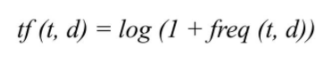
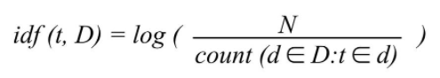

# TF-IDF (Term Frequency- Inverse Document Frequency)

This is a statistical measure to "quantify" what a document is about.
Used for information retrieval to return the most relevant results, and keyword extraction.


* t: the word in the document d
* D: from the document set D

**TF: Term frequency** is to know how frequently a word occurs in a document.



**IDF: Inverse document frequency** is to "decrease the weight for commonly used words" and "increases the weight for words that are not very much used" in a collection of documents.



[Dataset](http://jmcauley.ucsd.edu/data/amazon/)

```
vg = read.csv('video_game_reviews.csv',stringsAsFactors = F)
```
Steps:

## 1. Prepare Text: Bags of words approach, Semantic parsing

### (1) Create a corpus
```
library(tm)
corpus = Corpus(VectorSource(vg$review))
```

### (2) Clean the text: Transform text to lower case; Remove punctuation and stopwords, urls, whitespace
```
#Convert to lower case
corpus = tm_map(corpus,FUN = content_transformer(tolower))

#Replace url with blank space
corpus = tm_map(corpus,
                FUN = content_transformer(FUN = function(x)gsub(pattern = 'http[[:alnum:][:punct:]]*',
                                                                replacement = ' ',x = x)))
                                        #Remove punctuation
corpus = tm_map(corpus,FUN = removePunctuation)

#Remove stopwords (here as the, English, a)
corpus = tm_map(corpus,FUN = removeWords,c(stopwords('the', 'a', english')))

#Strip whitespace
corpus = tm_map(corpus,FUN = stripWhitespace)
```

### (3) Stem words: Only keep the root of words
Eg. 'recently' to 'recent'
```
corpus = tm_map(corpus,FUN = stemDocument)
```

### (4) Create a dictionary
If your document has certain terms that match with the column, this approach will put 1 or 0 to the cell.
```
#DocumentTermMatrix() will turn words into column.

dict = findFreqTerms(DocumentTermMatrix(Corpus(VectorSource(vg$review))),
                     lowfreq = 0)
dict_corpus = Corpus(VectorSource(dict))
#Similar words are groupe together
```

## 2. Create a DocumentTermMatrix (Tokenize): Unigram, Bigram, n-Gram, PoS Tagging, Chunking, Extracting co-occurrences
```
dtm = DocumentTermMatrix(corpus)
inspect(dtm) #to know the percentage of sparsity
```

* Tokenization of text will cause a large number of dimensions, which will lead to overfitting. So, it's important to use dimensionality reduction.

## 3. Dimensionality Reduction: 
Approaches include Dropping rare token (eg. token appears in fewer than 5% of documents), Principal Components Analysis, Correspondence Analysis, Singular Value Decomposition

### (1) Remove Spare Term: Dropping rare token
```
xdtm = removeSparseTerms(dtm,sparse = 0.95); xdtm
```
we convert the document-term-matrix to a data frame. Thereafter, any problems with column names as our column names will now be the tokens (i.e., words in the texts).

```
#use the dictionary created earlier to complete the stems
xdtm = as.data.frame(as.matrix(xdtm))
colnames(xdtm) = stemCompletion(x = colnames(xdtm),dictionary = dict_corpus,
type='prevalent')
colnames(xdtm) = make.names(colnames(xdtm))
```

## 4. Weighting: TF-IDF, SMART Weighting
Evaluate the frequency of the tokens to weight the tokens:
```
sort(colSums(xdtm),decreasing = T)
```
* colSums() is to sum the column
* A word that occurs more frequently gets weighted more than one that appears less frequently.

```
#Document Term Matrix - tfidf
dtm_tfidf = DocumentTermMatrix(x=corpus, control = list(weighting=function(x) weightTfIdf(x,normalize=F)))

xdtm_tfidf = removeSparseTerms(dtm_tfidf,sparse = 0.95)

xdtm_tfidf = as.data.frame(as.matrix(xdtm_tfidf))

colnames(xdtm_tfidf) = stemCompletion(x = colnames(xdtm_tfidf), dictionary = dict_corpus, type='prevalent')

colnames(xdtm_tfidf) = make.names(colnames(xdtm_tfidf))

sort(colSums(xdtm_tfidf),decreasing = T)
```

## 5. Predictive Modeling with Textual Features
```
vg_data = cbind(review_rating = vg$review_rating,xdtm)
vg_data_tfidf = cbind(review_rating = vg$review_rating,xdtm_tfidf)
```

### (1) Predictive Models (using TF features)

```
#Split Data (TF)
set.seed(617)
split = sample(1:nrow(vg_data),size = 0.7*nrow(vg_data))
train = vg_data[split,]
test = vg_data[-split,]

#cart
library(rpart); library(rpart.plot)
tree = rpart(review_rating~.,train)
rpart.plot(tree)

#predictions
pred_tree = predict(tree,newdata=test)
rmse_tree = sqrt(mean((pred_tree - test$review_rating)^2)); rmse_tree
```
### (2) Predictive Models (using TF-IDF features)
```
#Split Data (TF-IDF)
set.seed(617)
split = sample(1:nrow(vg_data_tfidf),size = 0.7*nrow(vg_data_tfidf))
train = vg_data_tfidf[split,]
test = vg_data_tfidf[-split,]

#cart
library(rpart); library(rpart.plot)
tree = rpart(review_rating~.,train)
rpart.plot(tree)

#predictions
pred_tree = predict(tree,newdata=test)
rmse_tree = sqrt(mean((pred_tree - test$review_rating)^2)); rmse_tree
```

Sources:

Analyzing word and document frequency: tf-idf https://www.tidytextmining.com/tfidf.html

Understanding TF-ID: A Simple Introduction https://monkeylearn.com/blog/what-is-tf-idf/#:~:text=TF%2DIDF%20(term%20frequency%2D,across%20a%20set%20of%20documents.
