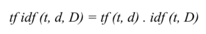
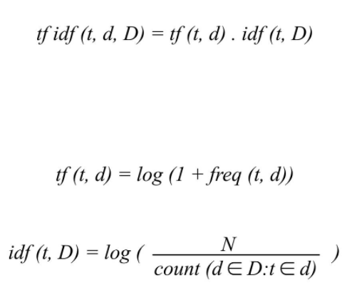

# TF-IDF (Term Frequency- Inverse Document Frequency)

This is a statistical measure to "quantify" what a document is about.

**TF: Term frequency** is to know how frequently a word occurs in a document.

**IDF: Inverse document frequency** is to "decrease the weight for commonly used words" and "increases the weight for words that are not very much used" in a collection of documents.

Sources:

Analyzing word and document frequency: tf-idf https://www.tidytextmining.com/tfidf.html
Understanding TF-ID: A Simple Introduction https://monkeylearn.com/blog/what-is-tf-idf/#:~:text=TF%2DIDF%20(term%20frequency%2D,across%20a%20set%20of%20documents.
