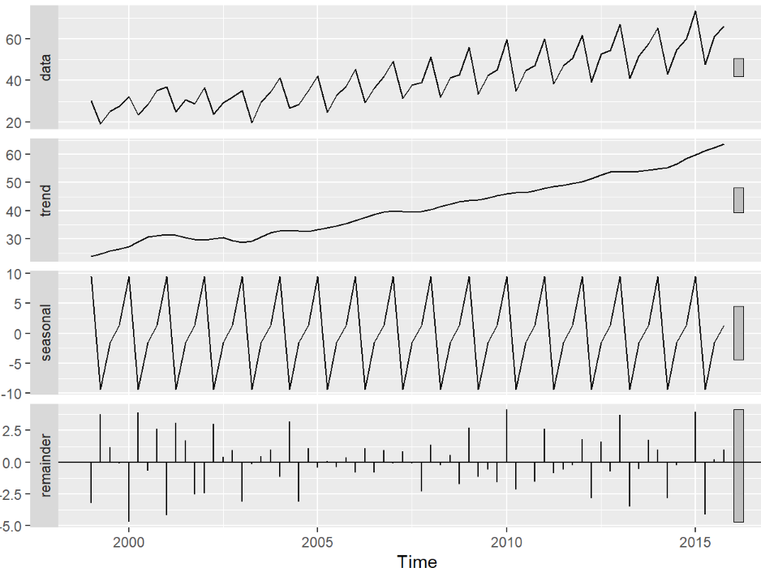
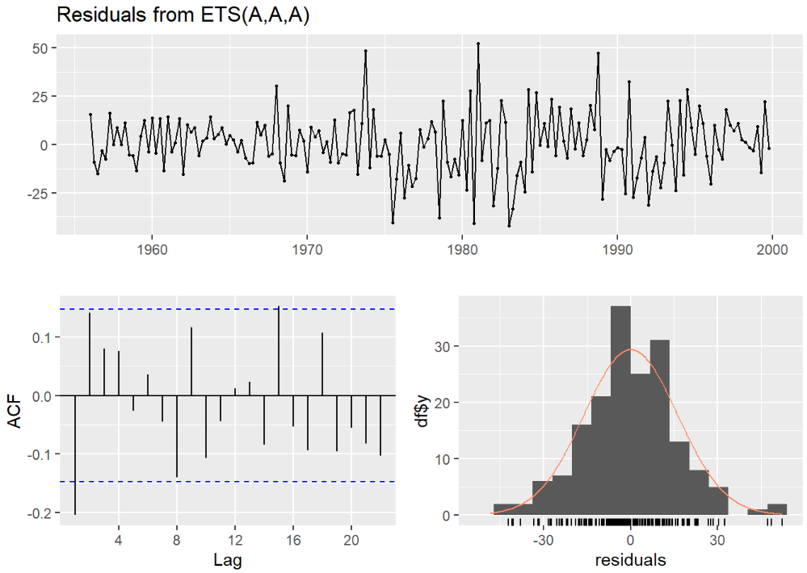
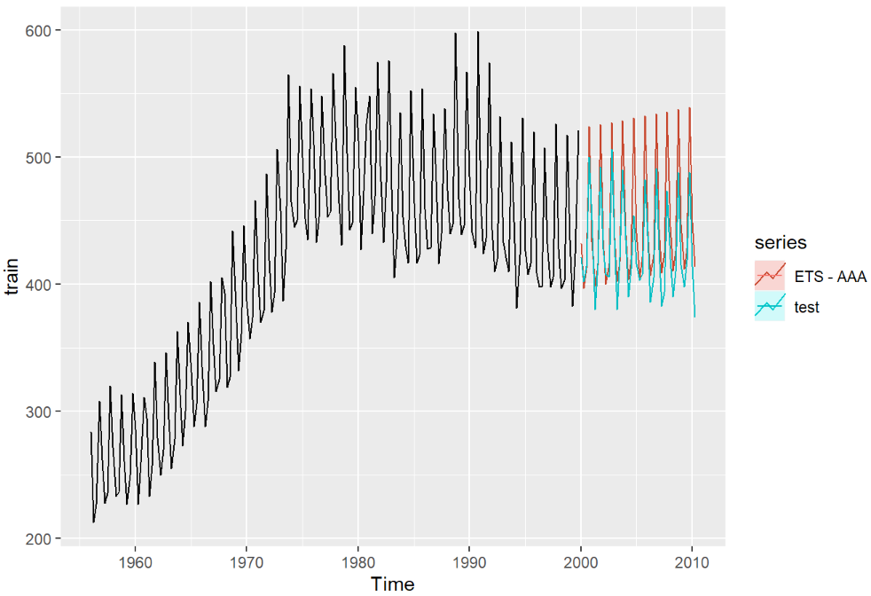
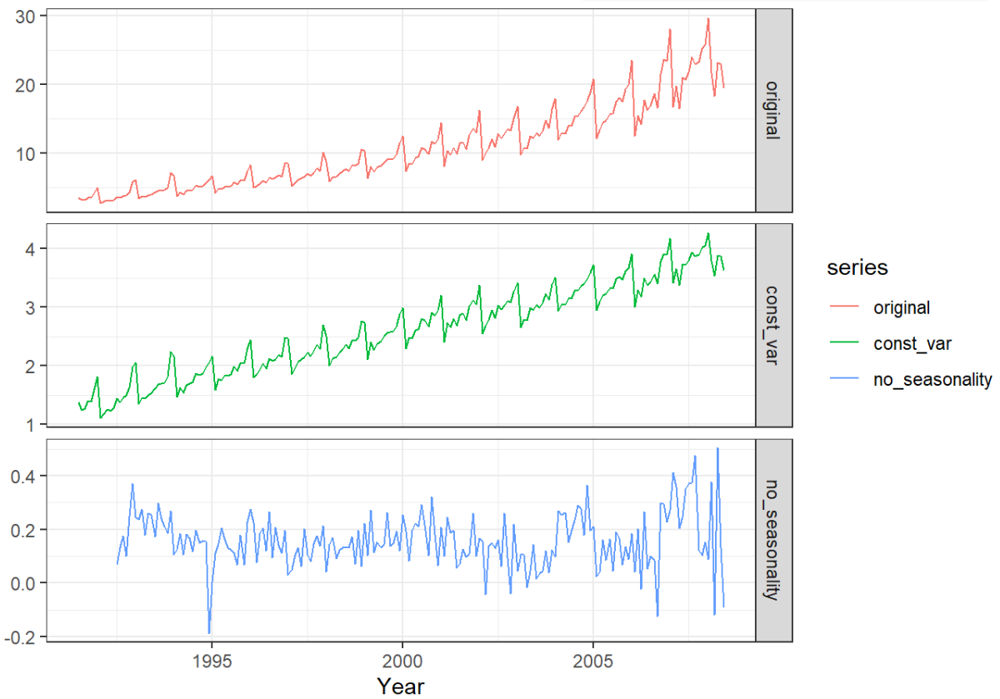
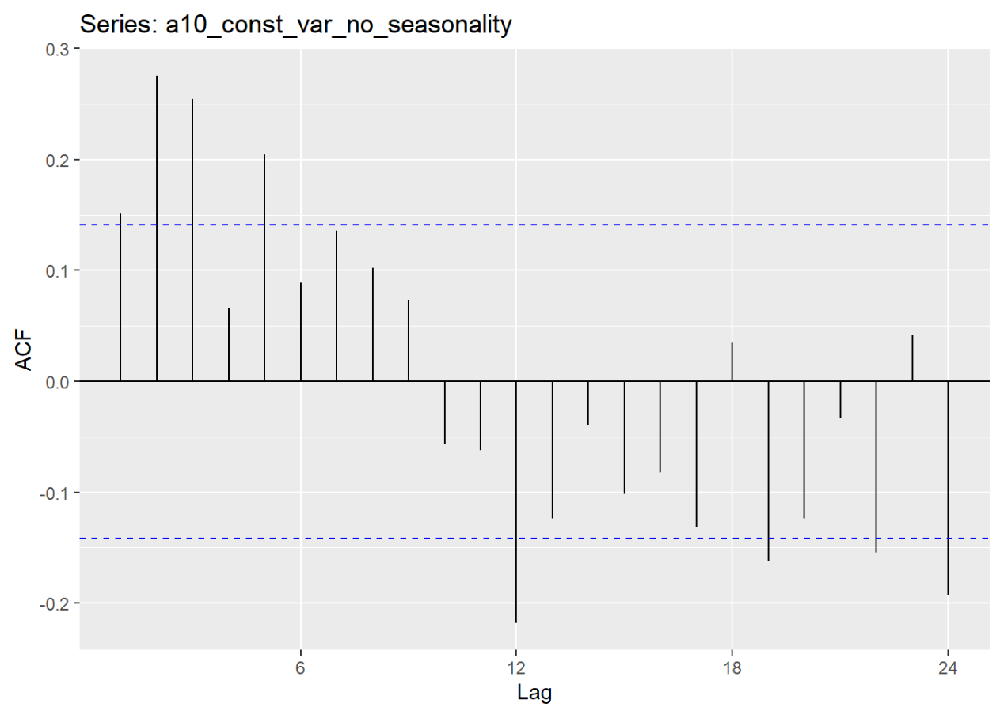
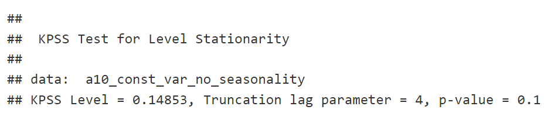

# Time Series
Exponential Smoothing and ARIMA are the most widely used approaches to time-series forecasting. 
- Expoenential Smoothing Models: Are based on a description of trend and seasonality in the data
- ARIMA models: AutoRegressive Integrated Moving Average. Aim to describe autocorrelations in the data. 

### Assumptions:

1. Consecutive observations are equally spaced
2. A discrete time/date index is applied

```
time(data) #To display all periods
deltat(data) #To know the minimum deltat between the time period. 
#Eg. one month is 1/12 of the year
```

### Create a ts object: 
(though mostly we will work with data that is already a time series object)
```
df = sample(seq(1e2,1e4,1)/1e2,size = 96,replace = T)
df_ts = ts(data=df,start = 2010,frequency = 12) #monthly frequency
df_ts

is.ts(df_ts) #Verify that df_ts is a ts object
```

## Nature of Time Series
Prior observations influence later observations.
### Time Series Pattern: 
- Trend: The influence is from the previous observation. Could be linear, non-linear, increasing or decreasing trend
- Seasonality: The influence is from an observation that is a **fixed** number of periods ago. Sasonality is always of a fixed or known frequency
```
#To clearly spot seasonality
ggseasonplot(data)
```
- Cycle: The influence is from an observation that is **not a fixed number** of periods ago
- Stationary Process: A time-series data that does not exhibit any pattern. **White Noise** is the simplest Stationary Process.

```
#In total there's 144 data points
x <- data[2:144] 
z <- data[1:143]
cor(x, z)
#The correlation between current and the month before data points
```

```
#Lag 1 autocorrelation: Examine the influence of prior observations
acf(x = data,lag.max = 1,plot=F) #1 max lag means one month apart
```

### Assumptions for Time Series Regression: 

1. Errors must have a mean of zero, are auto-correlated and unrelated to predictors. 
2. If errors is normally distributed, and have constant variance (no heteroscedasticity) could be useful.
3. Model reasonably approximate the reality

* Heteroskedasticity: Situations where the variance of the residuals is unequal over a range of measured values. 

## Seasonality and Trend Decomposition using Loess (STL): Decompose time series using STL to measure the strength of trend and seasonality

```
data %>%
  stl(s.window = 'periodic')%>%
  autoplot()
```



## Simple Forecasting Methods:
1. Average Method: Use the average (the baseline in linear regression)
```
average_model = meanf(train,h = 42) #since test data contains 42 quarters, we construct forecasts for 42 periods
#The model object contains a point forecast, and 80% and 95% confidence bands for the estimate.
```
```
library(forecast)
accuracy(average_model)

#To get test-set performance, set the x argument as the entire dataset rather than just the test set.
accuracy(average_model,x = ausbeer)

autoplot(train)+
  autolayer(average_model,PI = F,size=1.1,series = 'Average Model')+
  autolayer(test)
```
2. Naive Method: Future will be the same as the last observation. Also called random walk forecasts
```
naive_model = naive(train,h=42)
```
Can also query for accuracy, visual forecast here

3. Seasonal Naive Method: Forecast is equal to the last observed value from the same season
```
seasonal_naive_model = snaive(train,h=42)
```
4. Drift Method: Drift, the amount of change over time is set to be average change seen in historical data
```
drift_model = rwf(train,h=42,drift = T)
```

## Exponential Smoothing Models: Recent observations weighted more than distant observations

### 1. Simple Exponential Smoothing: 
Forecasts are calculated using weighted averages. Suitable for frocasting data with no clear trend or seasonal pattern.
```
ses_model = ses(train,h = 42)

autoplot(train)+
  autolayer(ses_model,series = "Simple Exponential Smoothing",PI = F, size=1.1)+
  autolayer(test)
```

### 2. Holt's Method: 
Extends simple exponential smoothing to allow the forecasting of data with a trend.
```
holt_model = holt(train,h=42)
```

### 3. Holt's Method with Damping: 
Forecasts generally display a constant trend indefinitely into the future.
```
holt_damped_model = holt(train,h=42,damped = T)
```

### 4. Holt-Winter's Seasonal Method: 
To caputre seasonality.

- Additive Method: Used when seasonal variations are roughly constant.
```
hw_additive = hw(train,h=42,seasonal = 'additive', damped=T)
```
- Multiplicative Method: Used when seasonal variations change in proportion to the level of the series.
```
hw_multiplicative = hw(train,h=42,seasonal = 'multiplicative', damped=T)
```
### ETS Models: 9 exponential smoothing methods by considering variations of trend (none, additive, additive damped) and seasonal components (non, additive, multiplicative)

When only the time-series is specified, and all other arguments are left at their default values, then ets() will automatically select the best model based on AICc.

1) Errors are Additive, ETS: AAA

Trend is Additive and Seasonal component is Additive
```
ets_aaa = ets(train,model = 'AAA')

#Examine the residuals
checkresiduals(ets_aaa)
```

```
ets_aaa_forecast = forecast(ets_aaa,h=42)

#accuracy with test 
accuracy(ets_aaa_forecast,x = ausbeer)

autoplot(train)+
  autolayer(ets_aaa_forecast,series="ETS - AAA",PI=F)+
  autolayer(test)
```


2) ETS: Automatic Selection
```
ets_auto = ets(train)
summary(ets_auto)

ets_auto_forecast = forecast(ets_auto,h=42)

accuracy(ets_auto_forecast,x = ausbeer)
```

**_While Exponential Smoothing models are based on a description of trend and seasonality in the data, ARIMA models aim to describe autocorrelations in the data._**

### AutoRegressive Integrated Moving Average (ARIMA):
ARIMA is estimated using maximum likelihood estimation. Use Information Criteria (AIC, BIC, AICc) to select the best values of p and q, but not for selecting the appropriate order of differencing (d)

### Stationary Process = Box-Cox Transformation (Stabilize Variance) + Remove seasonality and trend (Differencing)
- ARMA process assumes the data is stationary.
- Stationary Process has constant mean, variance and covariance.
```
#Stabilize Variance
a10_const_var = BoxCox(a10,lambda = BoxCox.lambda(a10))

#Remove Seasonality
a10_const_var_no_seasonality = diff(x = a10_const_var,lag = 12) 

#See the changes
dat = cbind(original = a10,
      const_var = a10_const_var,
      no_seasonality = a10_const_var_no_seasonality)
library(ggthemes)
autoplot(dat,facets=T,colour = T)+ylab('')+xlab('Year')+theme_bw()
```


Number of difference:
```
ndiffs(a10_const_var_no_seasonality)
#Returning 0 means you don't need differencing
```
*nsdiffs(): number of seasonal differencing*

```
#ACF plots to see if the data is stationary
ggAcf(a10_const_var_no_seasonality)
```

Much of the line is within decks, no differencing needed. But the spike may cause error in the future.

```
kpss.test(a10_const_var_no_seasonality)
```


#### AutoRegressive (AR): Forecast a variable using a linear combination of past values of the variable

#### Moving Average (MA): A moving average model use past forecast errors in a regression-like model

#### Non-Seasonal ARIMA + seasonal terms = Seasonal ARIMA = ARIMA(p, d, q) (P, D, Q) m
- (P, D, Q): Seasonal component 
- m: Number of periods per season

### ARIMA - Automatic Model Selection
```
model_auto = auto.arima(y = train,d = 1,D = 1,stepwise = F,approximation = F)
```


