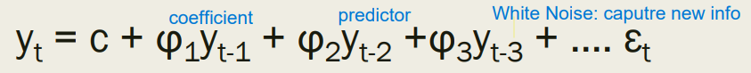
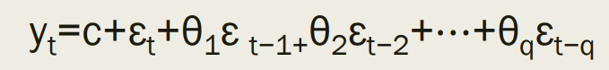

# Time Series
Exponential Smoothing and ARIMA are the most widely used approaches to time-series forecasting. 
- Expoenential Smoothing Models: Are based on a description of trend and seasonality in the data
- ARIMA models: AutoRegressive Integrated Moving Average. Aim to describe autocorrelations in the data. 

Assumptions:

1. Consecutive observations are equally spaced
2. A discrete time/date index is applied

Assumptions for Time Series Regression: 

1. Errors must have a mean of zero, are auto-correlated and unrelated to predictors. 
2. If errors is normally distributed, and have constant variance (no heteroscedasticity) could be useful.
3. Model reasonably approximate the reality

* Heteroskedasticity: Situations where the variance of the residuals is unequal over a range of measured values. 

## Simple Forecasting Methods:
1. Average Method: Use the average (the baseline in linear regression)
2. Naive Method: Future will be the same as the last observation
3. Seasonal Naive Method: Forecast is equal to the last observed value from the same season
4. Drift Method: Drift, the amount of change over time is set to be average change seen in historical data

## Exponential Smoothing Models: Recent observations weighted more than distant observations
### 1. Simple Exponential Smoothing: 
Forecasts are calculated using weighted averages. Suitable for frocasting data with no clear trend or seasonal pattern.

### 2. Holt's Method: 
Extends simple exponential smoothing to allow the forecasting of data with a trend.

### 3. Holt's Method with Damping: 
Forecasts generally display a constant trend indefinitely into the future.

### 4. Holt-Winter's Seasonal Method: 
To caputre seasonality.

- Additive Method: Used when seasonal variations are roughly constant.
- Multiplicative Method: Used when seasonal variations change in proportion to the level of the series.

### Stationary Process = Box-Cox Transformation (Stabilize Variance) + Remove seasonality and trend (Differencing)

### AutoRegressive Integrated Moving Average (ARIMA):
ARIMA is estimated using maximum likelihood estimation. Use Information Criteria (AIC, BIC, AICc) to select the best values of p and q, but not for selecting the appropriate order of differencing (d)

#### AutoRegressive (AR): Forecast a variable using a linear combination of past values of the variable

#### Moving Average (MA): A moving average model use past forecast errors in a regression-like model

#### Non-Seasonal ARIMA + seasonal terms = Seasonal ARIMA = ARIMA(p, d, q) (P, D, Q) m
- (P, D, Q): Seasonal component 
- m: Number of periods per season

